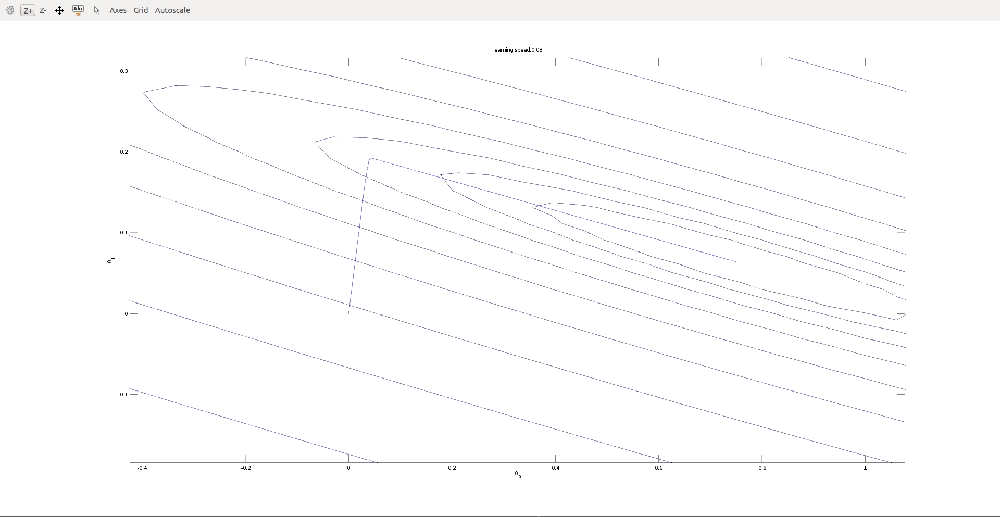

# Linear Regression

> These exercises have been extensively tested with Matlab, but they should also work in Octave, which has been called a "free version of Matlab." 
> If you are using Octave, be sure to install the Image package as well.

## Data

The .dat files contain some example measurements of heights for various boys between the ages of two and eights. The y-values are the heights measured in meters, and the x-values are the ages of the boys corresponding to the heights.

Each height and age tuple constitutes one training example `x^(i), y^(i)` in our dataset. There are `m = 50` training examples, and you will use them to develop a linear regression model

## Matlab Code

### ex2.m

#### linear fit:
batch gradient descent update rule is:  
 

#### cost function J(theta):
define as: 
can also be written in vectorized form: 
where 


#### result:
```
theta =

   0.750150
   0.063883

exact_theta =

   0.750163
   0.063881

predict1 =  0.97374
predict2 =  1.1973
```

### gradient_descent_demo.m
> how learning speed impact Gradient Descent?

#### learning speed: 0.01:


#### learning speed: 0.03:


#### learning speed: 0.05:


#### learning speed: 0.07:


#### result:
```
learning speed: 0.01
theta =

   0.750153
   0.063883

num_iterations =  10761
learning speed: 0.03
theta =

   0.750153
   0.063883

num_iterations =  3584
learning speed: 0.05
theta =

   0.750153
   0.063883

num_iterations =  2149
learning speed: 0.07
theta =

   0.750153
   0.063883

num_iterations =  1534
```

### theta_converges_demo.m
> em2.md set `MAX_ITR = 1500`;
Here we try `gradient < 1.0e-6` to estimate total iterations

#### result:
```
theta =

    0.750153
    0.063883

num_iterations =  1534
```
