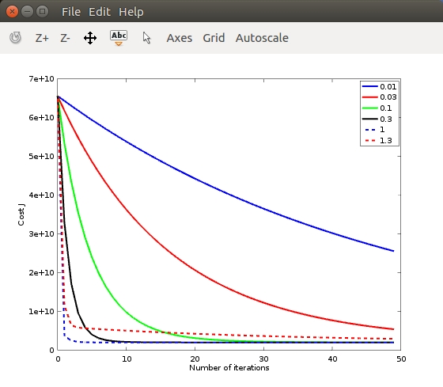
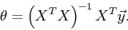
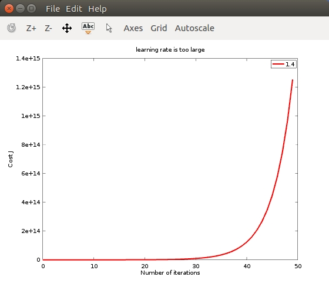

# Multivariate Linear Regression

## Data
This is a training set of housing prices in Portland, Oregon, where the outputs y(i) are the prices and the inputs x(i) are the living area and the number of bedrooms. There are m=47 training examples.

## ex3.m
select a learning rate:



normal equations get same prediction, [最小二乘法的解](https://zh.wikipedia.org/wiki/%E6%9C%80%E5%B0%8F%E4%BA%8C%E4%B9%98%E6%B3%95)

```
theta_grad_descent =

   340412.65957446810
   110631.05027884612
    -6649.47427081980

price_grad_desc =  293081.464334896
theta_normal =

   89597.909542798108
     139.210674017626
   -8738.019112328067

price_normal =  293081.46433489
```

## learning_rate_is_too_large.m


